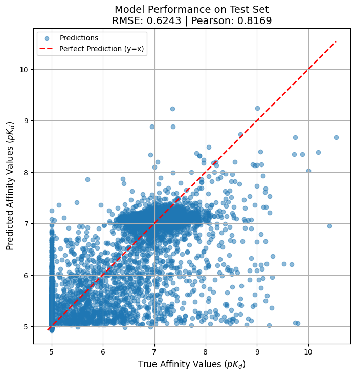

# DeepDTI-Affinity: A Multi-Modal Model for Drug-Target Binding Affinity Prediction


This project presents a sophisticated deep learning model for predicting Drug-Target Interaction (DTI) binding affinity. By leveraging a multi-modal architecture, the model takes a drug's molecular structure (as a SMILES string) and a protein's amino acid sequence as input to predict their binding strength ($pK_d$).

The project progresses from a simple binary classification task to a more challenging and scientifically relevant regression problem, incorporating advanced techniques to handle common bioinformatics challenges like severe data imbalance.

---

## Final Results

After a multi-stage training process involving pre-training encoders and fine-tuning a classifier head on a synthetically balanced dataset, the final model achieved a **Pearson Correlation of ~0.82** and an **RMSE of ~0.62** on the test set.

The scatter plot below visualizes the model's performance, showing a strong correlation between the true and predicted affinity values.



---

## Project Workflow & Methodology

This project followed an iterative and data-centric workflow to tackle the DTI problem:

1.  **Initial Classification Model:** The project started as a binary classification task (predicting bind/no-bind), which quickly achieved near-perfect scores, revealing that simple negative sampling made the task trivial.

2.  **Transition to Regression:** To create a more realistic challenge, the problem was reframed as a regression task to predict the continuous binding affinity ($pK_d$) from the Davis dataset.

3.  **Advanced Model Architecture:**
    * **Drug Encoder:** A **Graph Attention Network (GAT)** was implemented using PyTorch Geometric to process drug SMILES strings by converting them into molecular graphs.
    * **Protein Encoder:** A deep **1D Residual CNN** was built to capture complex local and hierarchical patterns from the protein amino acid sequences.
    * **Interaction Head:** A deep, multi-layer perceptron (MLP) was used to predict the final affinity value from the concatenated drug and protein embeddings.

4.  **Data-Centric Fine-Tuning (The Breakthrough):**
    * **Problem Identification:** A thorough analysis revealed that the dataset was heavily imbalanced, with most samples having very low binding affinity. This caused the model to have a "conservative bias."
    * **Solution:** A two-stage fine-tuning approach was implemented:
        1.  **Encoder Pre-training:** The full model was trained on the original dataset to learn robust feature representations (embeddings).
        2.  **SMOTE for Regression:** A manual, fast SMOTE-like algorithm was used to generate synthetic data points in the **embedding space**, specifically oversampling the rare high-affinity samples to balance the dataset.
        3.  **Classifier Fine-tuning:** The pre-trained encoders were frozen, and only the final classifier head was re-trained on this new, high-quality balanced dataset.

---

## How to Run

This project was developed in a notebook environment like Google Colab.

### 1. Download the Dataset
The direct download link for the Davis dataset expires periodically. Therefore, you need to get the latest link from the source website.

1.  **Go to the dataset source page:** [Davis-KIBA](https://www.kaggle.com/datasets/christang0002/davis-and-kiba?resource=download&select=davis.txt)
2.  In the **"Benchmark datasets"** section, find the **"Davis"** dataset.
3.  **Right-click** on the download link (e.g., `davis.rar` or `davis.tar.gz`).
4.  Select **"Copy Link Address"** from the context menu.
5.  **Pas

1.  **Clone the repository:**
    ```bash
    git clone https://github.com/Hosein541/DeepDTI-Affinity.git)
    cd DeepDTI-Affinity
    ```
2.  **Run the Notebook:**
    Open the `DeepDTI-Affinity.ipynb` notebook and execute the cells in order. The notebook is structured to cover the entire pipeline from data download to final model training and evaluation.
   
---

## Key Dependencies
* PyTorch
* PyTorch Geometric (`torch_geometric`)
* RDKit (`rdkit-pypi`)
* Pandas & NumPy
* scikit-learn
* `smogn` (or the manual SMOTE implementation included in the notebook)
* Matplotlib

A `requirements.txt` file can be generated for easy setup.

---

## Future Work

As identified in the final analysis, the primary limitation of this task is the inherent imbalance of the Davis dataset. While the SMOTE-based oversampling strategy proved highly effective, further improvements could be explored:

* **Advanced Loss Functions:** Implement custom, dynamic loss functions that are more robust to imbalanced regression.
* **Alternative Datasets:** Test the model's generalization capabilities on other DTI datasets like KIBA.
* **Transformer-based Encoders:** Replace the 1D CNN for protein sequences with a more powerful pre-trained Transformer model like ESM-2 to potentially capture long-range dependencies more effectively.

  
## Contact
* **Author:** Hosein Mohammadi
* **Date:** July 2024
* **Contact:** [huseinmohammadi83@gmail.com](mailto:huseinmohammadi83@gmail.com)
* **LinkedIn:** [Hosein Mohammadi](https://www.linkedin.com/in/hosein-mohammadi-979b8a2b2/) 


---

## License

This project is licensed under the MIT License. See the `LICENSE` file for details.
